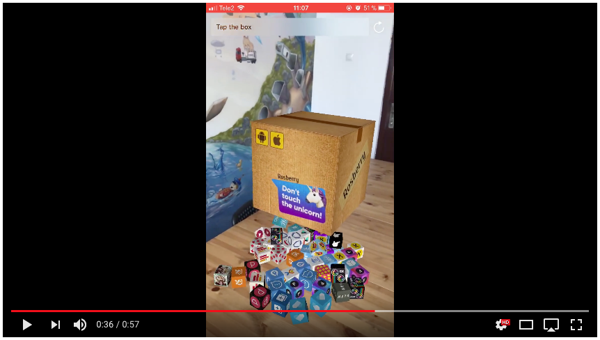

# Rosberry pARtfolio

Simple [ARKit](https://developer.apple.com/arkit/) example with Rosberry apps.

## Requirements

- iOS 11.0+
- Xcode 9.0+
- An iOS device with an A9 or better processor (iPhone 6s or superior, iPad Pro, iPad 2017)

## Installation

Download the project and build on device.

#### 😁 Authors

* Artem Novichkov, artem.novichkov@rosberry.com

## About

This project is owned and maintained by Rosberry. We build mobile apps for users worldwide 🌏.

Check out our [open source projects](https://github.com/rosberry), read [our blog](https://medium.com/@Rosberry) or give us a high-five on 🐦 [@rosberryapps](http://twitter.com/RosberryApps).

## License

Rosberry pARtfolio is available under the MIT license. See the LICENSE file for more info.
